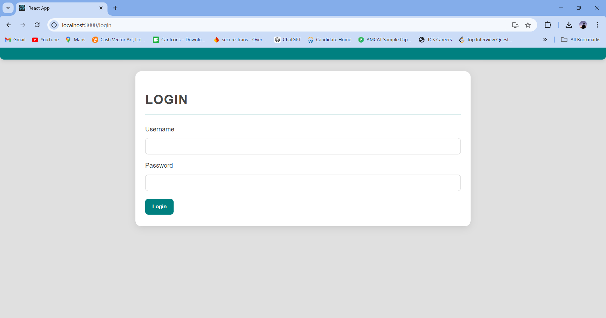
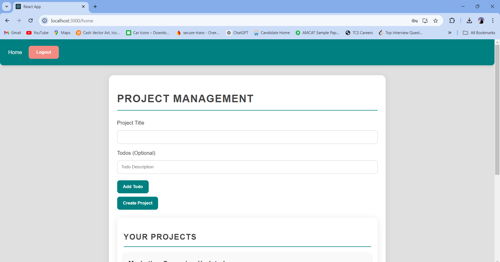
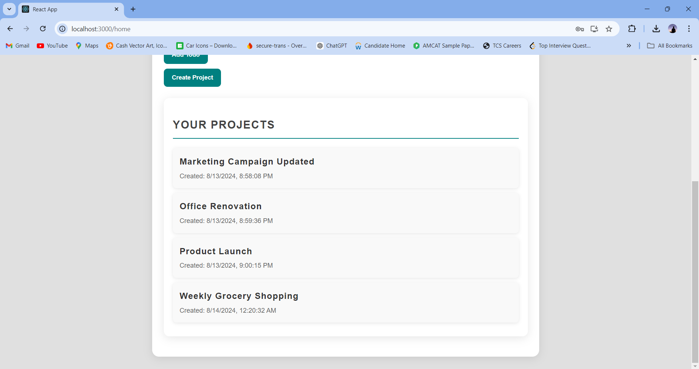
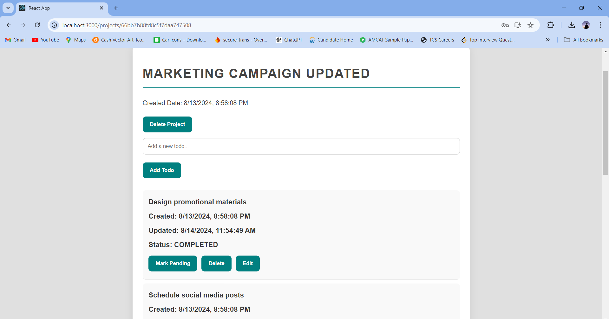
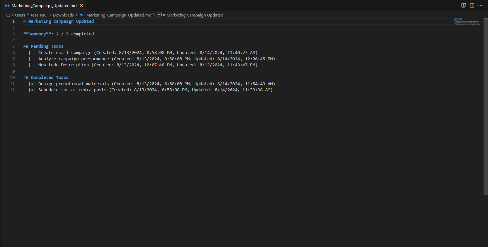

# Todo App with Spring Boot and React

## Overview

This project is a full-stack web application that combines a Spring Boot backend with a React frontend. The application is designed to manage projects and their associated tasks (todos). Users can create, update, delete projects and todos, and export project summaries. Basic authentication is implemented to secure the application, ensuring that only authenticated users can manage projects and tasks.

## Features

- **User Authentication**: Basic authentication for secure access.
- **Project Management**:
  - Create new projects with a title and optional list of todos.
  - View a list of all projects.
  - View detailed information for a specific project, including its todos.
  - Update project details.
  - Delete projects, including all associated todos.
- **Todo Management**:
  - Add new todos to a project.
  - Edit existing todos.
  - View details of each todo, including status (Pending/Completed), created date, and updated date.
  - Update the status of todos (mark as complete or pending).
  - Delete individual todos from a project.
- **Export Project Summary**:
  - Export project summaries as markdown files locally.

## Technologies Used

### Backend
- **Java**: Programming language used to build the backend.
- **Spring Boot**: Framework used for developing the backend RESTful API.
- **MongoDB**: NoSQL database for storing project and todo data.
- **Spring Security**: For implementing basic authentication.
- **Maven**: Build automation tool for managing dependencies and building the project.

### Frontend
- **React**: JavaScript library for building the user interface.
- **React Router**: For handling navigation and routing in the React application.
- **HTML/CSS**: For structuring and styling the frontend.
- **Bootstrap**: CSS framework for responsive and modern design.

## Screenshots

### 1. Login Page


### 2. Home Page


### 3. Projects


### 4. Todo List Page


### 4. Export Summary


## Prerequisites

Before running this project, ensure you have the following installed:

- **Java 17**: [Download Java](https://www.oracle.com/java/technologies/javase-jdk17-downloads.html)
- **Maven**: [Download Maven](https://maven.apache.org/download.cgi)
- **Node.js and npm**: [Download Node.js](https://nodejs.org/)
- **MongoDB**: [Download MongoDB](https://www.mongodb.com/try/download/community)

## API Endpoints

| **Category**     | **Method** | **Endpoint**                          | **Description**                            |
|------------------|------------|---------------------------------------|--------------------------------------------|
| **Authentication** | POST       | `/login`                              | Authenticate a user                        |
| **Projects**       | GET        | `/api/projects`                       | Retrieve all projects                      |
| **Projects**       | POST       | `/api/projects`                       | Create a new project                       |
| **Projects**       | GET        | `/api/projects/{id}`                  | Retrieve a specific project by ID          |
| **Projects**       | PUT        | `/api/projects/{id}`                  | Update a specific project by ID            |
| **Projects**       | DELETE     | `/api/projects/{id}`                  | Delete a specific project by ID            |
| **Todos**          | POST       | `/api/projects/{id}/todos`            | Add a new todo to a project                |
| **Todos**          | PUT        | `/api/projects/{id}/todos/{todoId}`   | Update a specific todo by ID               |
| **Todos**          | DELETE     | `/api/projects/{id}/todos/{todoId}`   | Delete a specific todo by ID               |


## Getting Started

### 1. Clone the Repository

```bash
git clone https://github.com/Josepaul2k01/todo-app.git
cd todo-app


